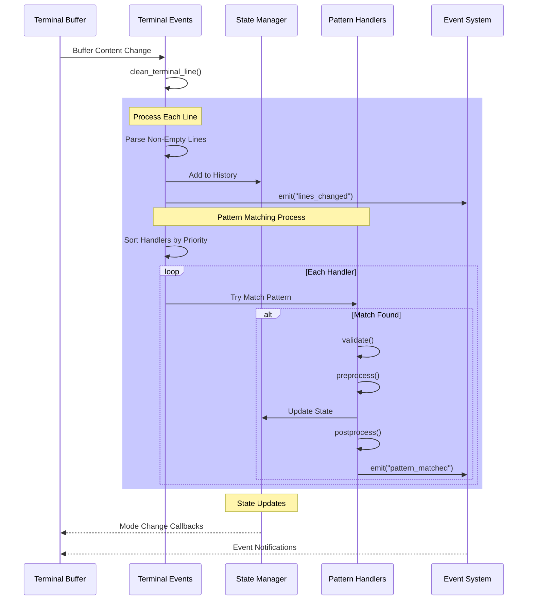

# Aider.nvim

An AI-assisted coding plugin for Neovim, integrating the Aider CLI tool.

## TODO

- [ ] save current state (model, file list presistant)
- [ ] add current as readonly
- [x] add file from snacks file list
- [x] auto start (with deffer) aider if necessary when send to aider.
- [ ] tree-sitter on response
- [x] aider run in background when windows is close.
- [x] send code should include path and line info
- [x] :AiderNo
- [x] :AiderYes
- [x] defer reload modify file
- [x] scroll left when chunk changes came in
- [x] only enable log when .aider.xxxx exists
- [x] scroll to bottom when terminal on focus
- [x] show diagnostic in dialog before fix
- [ ] aider command in dialog
- [ ] forward aider confirmation to neovim ui
- [ ] show diff
- [ ] watching only aider is enabled or setup
- [x] sync buffers list to watch handler (active only)
- [x] send current file
- [x] watching file change
- [x] dialog for prompt
- [x] fix diagnostic

## System Architecture

### Terminal Processing Flow

