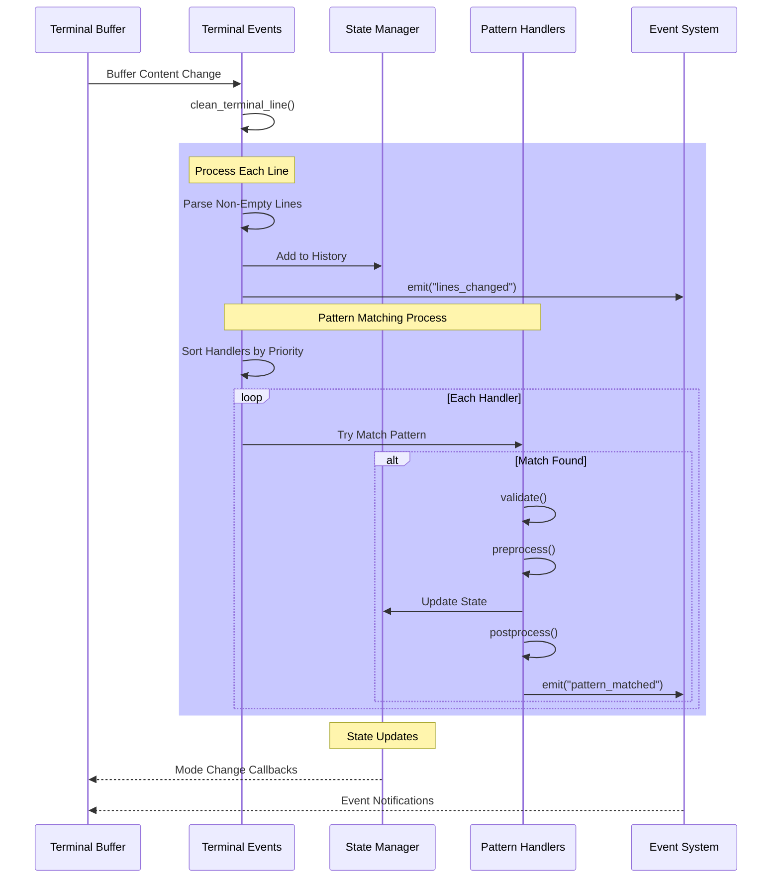

# Aider.nvim

An AI-assisted coding plugin for Neovim, integrating the Aider CLI tool.

## TODO

- [x] setup debug log and disable by default.
- [x] ~~save current state (model, file list presistant)~~ => use lua config
- [x] add current as readonly
- [x] add file from snacks file list
- [x] auto start (with deffer) aider if necessary when send to aider.
- [x] aider run in background when windows is close.
- [x] send code should include path and line info
- [x] :AiderNo
- [x] :AiderYes
- [x] defer reload modify file
- [x] scroll left when chunk changes came in
- [x] only enable log when .aider.xxxx exists
- [x] scroll to bottom when terminal on focus
- [x] show diagnostic in dialog before fix
- [ ] aider command in dialog
- [ ] forward aider confirmation to neovim ui
- [ ] show diff
- [ ] watching only aider is enabled or setup
- [x] sync buffers list to watch handler (active only)
- [x] send current file
- [x] watching file change
- [x] dialog for prompt
- [x] fix diagnostic

## System Architecture

### Terminal Processing Flow



```d2
Lines
  Events -> State: Add to History
  Events -> EventEmitter: emit("lines_changed")

  "Pattern Matching Process": {
    Events -> Events: Sort Handlers by Priority

    "loop Each Handler": {
      style.fill: '#FFFF00'
      Events -> Patterns: Try Match Pattern
      Patterns -> Patterns: validate()
      Patterns -> Patterns: preprocess()
      Patterns -> State: Update State
      Patterns -> Patterns: postprocess()
      Patterns -> EventEmitter: emit("pattern_matched")
    }
  }
}

State -> Terminal: Mode Change Callbacks
EventEmitter -> Terminal: Event Notifications
t Change
Events -> Events: clean_terminal_line()

"Process Each Line": {
  Events -> Events: Parse Non‑Empty shape: sequence_diagram

Terminal
Events
State
Patterns
EventEmitter

Terminal -> Events: Buffer Conten
```

[D2 srouce](https://play.d2lang.com/?script=fJLPitswEMbveorBPezuoWXPOhTaYLOH7mJIejYTeRyLypIrTQKmBPoKfcU-SZElN2sScvBBM7_5_M2f0ONIEgL9PJJV1LQaDx4HIXbkB23RiPJEloPYMjKJGpnJ25Ci5aDj8wLDx8-QeAlfj11HHjbOMlmGTY_2QFntPacMoW04KzRGW3p8EqKovVMUApSoevimLRUSfgmAa4UafSB4c_bv7z_lMPI042HFzvYlfGlbYAcvOrDz07Va7kgCDZofi2gmNGq23hZPQgAUeQTwiqx6bQ-QjWZ7twxunWd4Qdsa8gH2E9ReO695EnNBYZwbU58Z-q8FEHgy9KnTxkh4-FBVVfX8_JBzlz8te5Gw81OytsQyuxBr-oRGt8hx4vew0dOYurwJ5uF-H6NUet2Xc4Hv6d1axZjyzRB7m5cRq84ifmeRzjPWLqco4dW1lM8ONmjMHtWP9eGu-TkDb451pxWydjaIfwEAAP__&layout=dagre&theme=300&sketch=1&)
